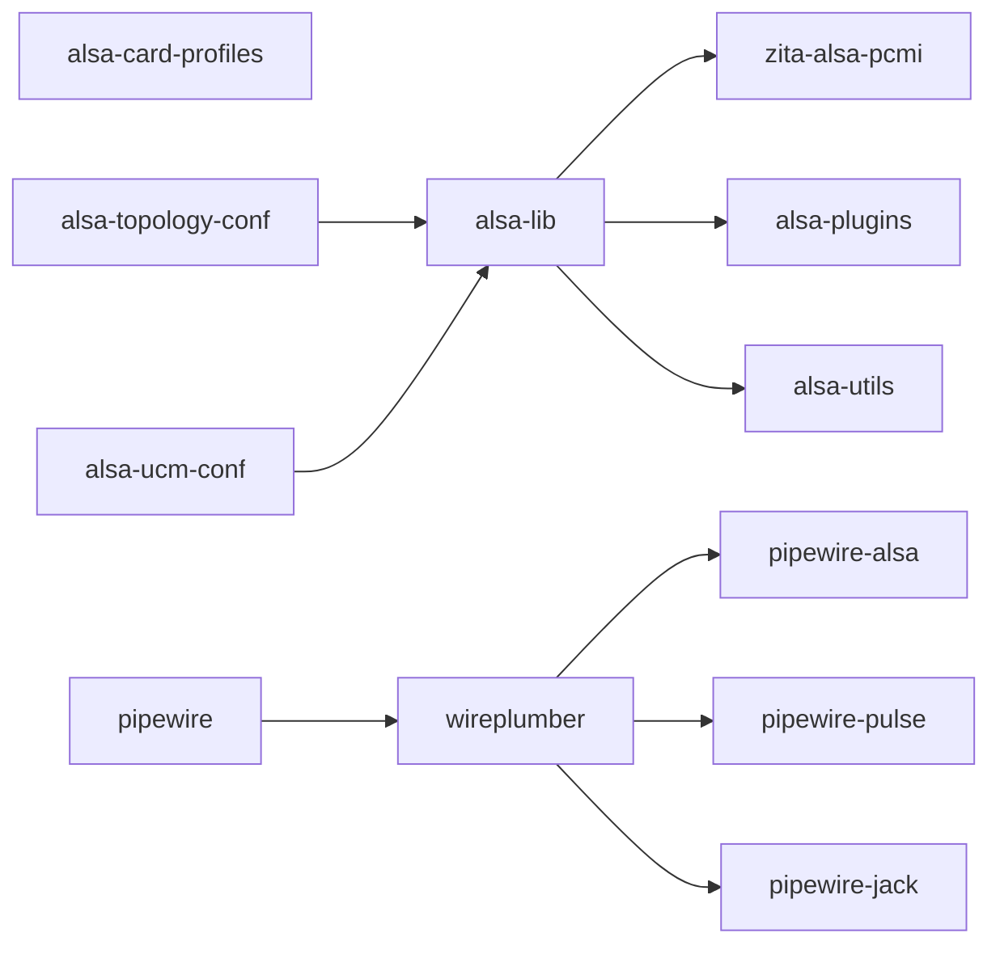

## 声卡驱动

```bash
$ sudo pacman -S sof-firmware
```

## 音频管理器

```bash
# 本体 及 会话/策略管理器
$ sudo pacman -S pipewire wireplumber

# 替代老牌音频调节器的前端
$ sudo pacman -S pipewire-pulse pipewire-alsa pipewire-jack
```

重开终端，启用相关服务：

```bash
# 启用Pipewire相关服务：
$ systemctl enable pipewire --user
$ systemctl enable pipewire-pulse --user
```


